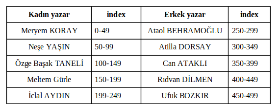
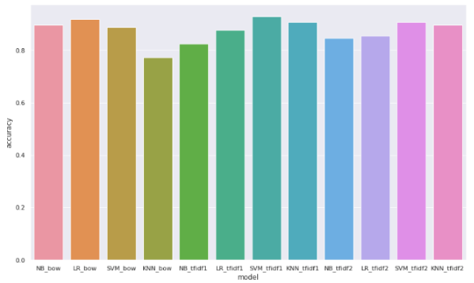
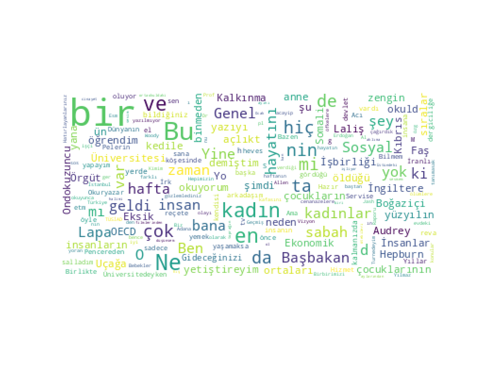
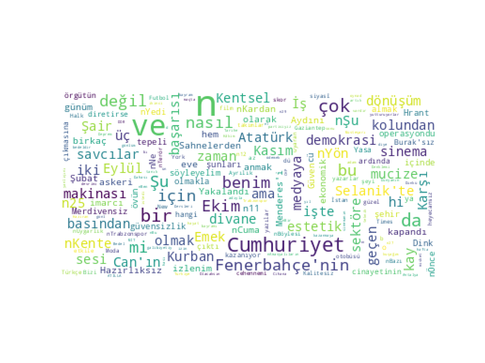

Data source: http://www.kemik.yildiz.edu.tr/veri_kumelerimiz.html

2500 köse yazisi verikümesi:  50 köse yazarina ait 50'ser köse yazisi

Verisetinden 5 kadın 5 erkek yazar seçilerek, her birinden 50' şer köşe yazısı olmak üzere 500 köşe yazısı içeren alt veri kümesi oluşturulmuştur.

Seçilen yazarlar 

Otomatik cinsiyet tahmini sosyal medya platformlarının yoğun olarak kullanıldığı çağımızda rağbet görmeye başlamıştır. Cinsiyet, sosyal etkileşimde temel bir rol oynamakla birlikte, erişim kontrolü, insan-bilgisayar etkileşimi, kanun yaptırımı ve pazarlama zekası gibi akıllı uygulamalarda önemli bir görev görmektedir. Bu çalışmada, mevcut veri setlerinde cinsiyetleri bilinen kadın ve erkek yazarlara ait 2500 köşe yazıları veri seti kullanılmıştır. Veri Seti doğal dil işleme teknikleri ile ön işlemden geçirilmiş Bag of Words ve TF-IDF yöntemleri ile vektörleştirilmiştir. Vektörleştirilen veri eğitim ve test olarak ayrılmış ve eğitim verisi çeşitli algoritmalarla eğitilmiştir. Eğitim sonrası model geliştirilmiş ve model test verisine uygulanarak doğruluk değeri ve hata matrisleri elde edilmiştir. 

Çalışmada karşılaştırma yapabilmek için Bag of Words, TF-IDF, parametreleri değiştirilmiş TF-IDF gibi farklı vektörleştirmeler kullanılarak hazırlanmış veri seti Naive Bayes, Logistic Regresyon, Destek Vektör Makinesi ve K En Yakın Komşu algoritması gibi farklı algoritmalar ile eğitilmiştir. Çalışma sonucu TF-IDF ile vektörleştirilmiş veri setinde Destek Vektör Makinesi en başarılı bulunmuştur.

Accuracy grafiği

Wordcloud cinsiyet:kadın

Wordcloud cinsiyet:erkek

